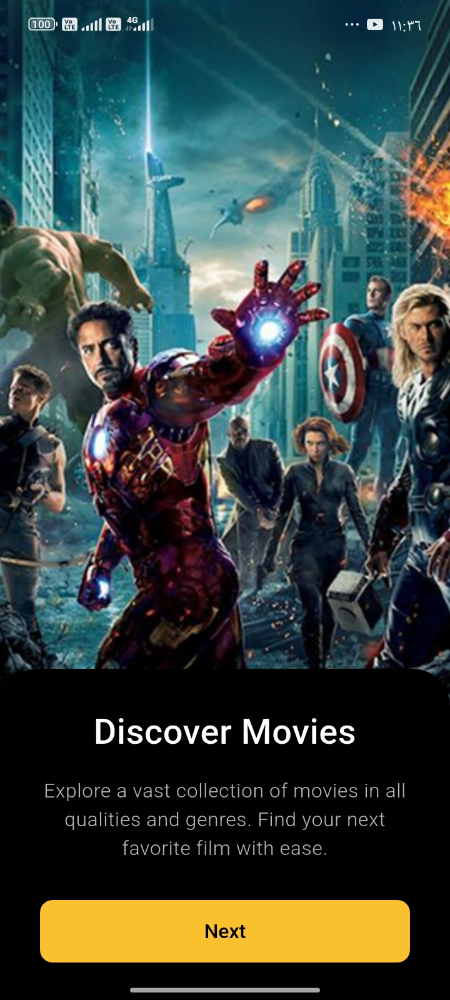
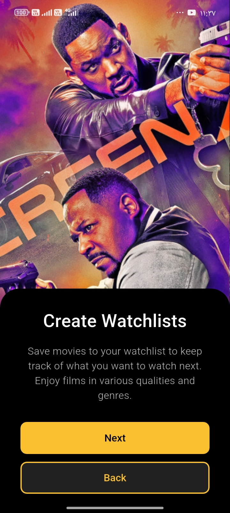
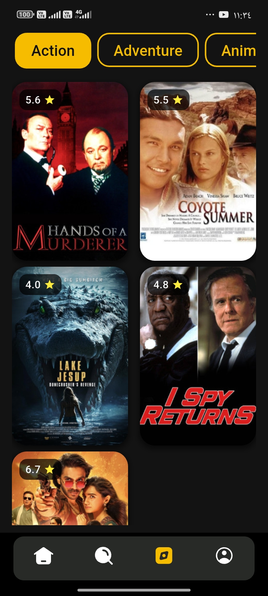

# Movie App

<p align="center">
  
</p>

## Description

A modern Flutter movie application featuring full movie browsing, detailed pages, favorites system, viewing history,
profile editing, authentication, and advanced state management using Bloc. The app integrates with a real API using Dio
and provides a clean, scalable architecture with an elegant dark UI.
Built with **Flutter** .

## Getting Started 🚀

### Dependencies 📦

This project uses the following packages:

- [flutter_svg: ^2.0.10+1](https://pub.dev/packages/flutter_svg) – Render SVG files
- [cupertino_icons: ^1.0.8](https://pub.dev/packages/cupertino_icons) – iOS style icons
- [animated_toggle_switch: ^0.8.2](https://pub.dev/packages/animated_toggle_switch) – Beautiful animated toggle switches
- [firebase_core: ^3.1.1](https://pub.dev/packages/firebase_core) – Firebase core functionality
- [firebase_auth: ^5.1.1](https://pub.dev/packages/firebase_auth) – Firebase authentication
- [flutter_bloc: ^8.1.6](https://pub.dev/packages/flutter_bloc) – State management with Bloc/Cubit
- [equatable: ^2.0.5](https://pub.dev/packages/equatable) – Simplify equality comparisons
- [provider: ^6.1.2](https://pub.dev/packages/provider) – Dependency injection & simple state management
- [google_sign_in: ^6.2.1](https://pub.dev/packages/google_sign_in) – Google Sign-In integration
- [dio: ^5.9.0](https://pub.dev/packages/dio) – Powerful HTTP client with interceptors
- [youtube_player_flutter: ^9.1.3](https://pub.dev/packages/youtube_player_flutter) – YouTube video player
- [shared_preferences: ^2.5.3](https://pub.dev/packages/shared_preferences) – Store simple key-value data locally
- [flutter_secure_storage: ^9.2.4](https://pub.dev/packages/flutter_secure_storage) – Secure storage for tokens &
  sensitive data

## Dev Dependencies

- [flutter_test](https://pub.dev/packages/flutter_test) – Testing framework for Flutter
- [flutter_lints](https://pub.dev/packages/flutter_lints) – Recommended lints for Flutter projects

## Help

This App is using:

- **SharedPreferences** → To save simple app settings (Onboarding status, language, theme, etc.)
- **flutter_secure_storage** → To securely store sensitive data such as the authentication token (encrypted using
  Android Keystore & iOS Keychain)

This ensures a smooth auto-login experience while keeping user data safe and protected.

## Images

```bash
images
```

<p align="left">
  
  
  
  
  
  
  
</p>
<p align="left">
  
  
  
</p>
<p align="left">
  
  
  
  
  
  
  
</p>
<p align="left">
  
  
  
  
</p>
