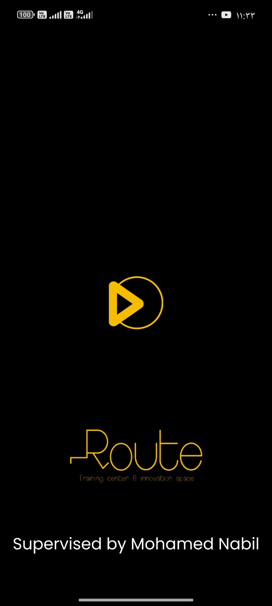
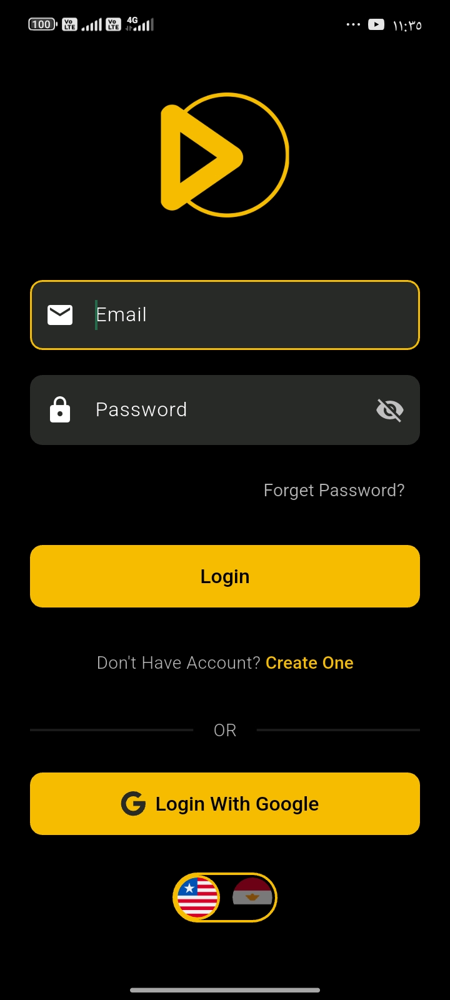
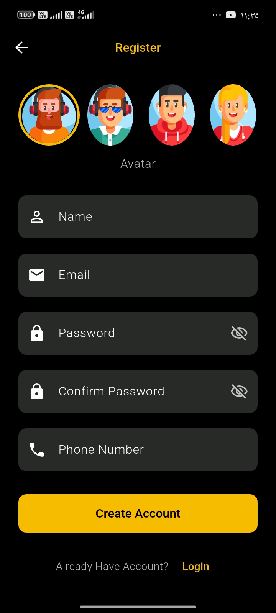
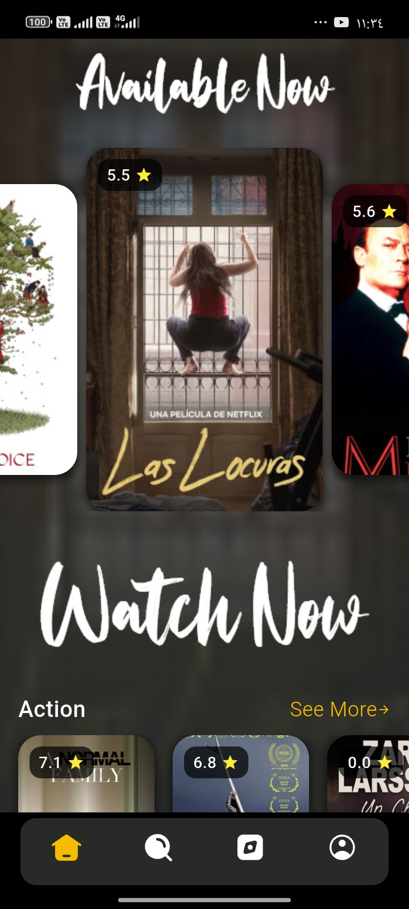
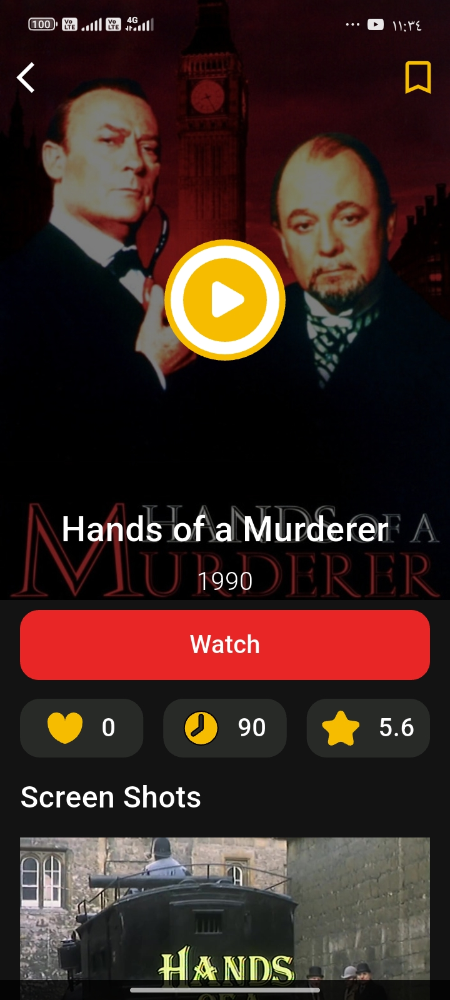
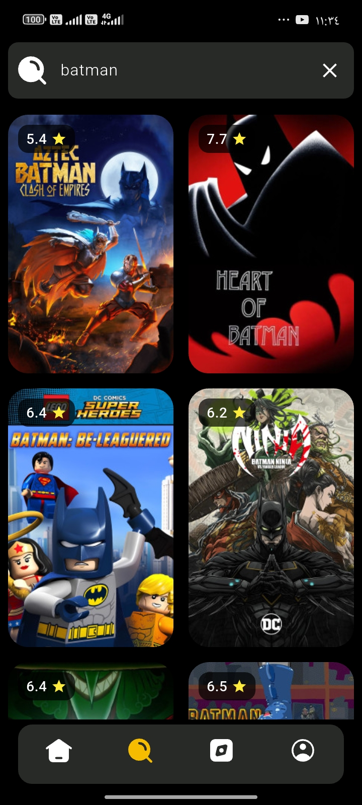
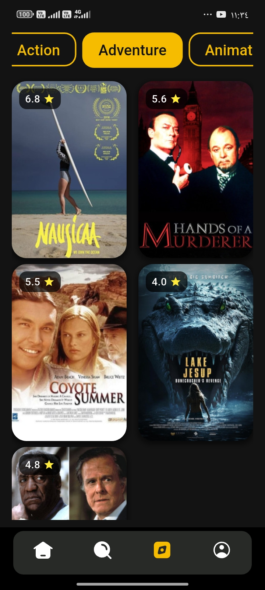
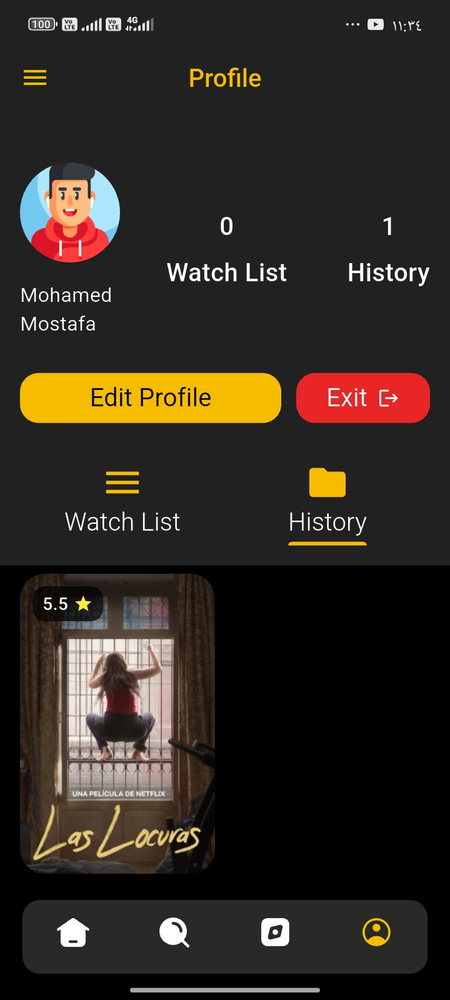
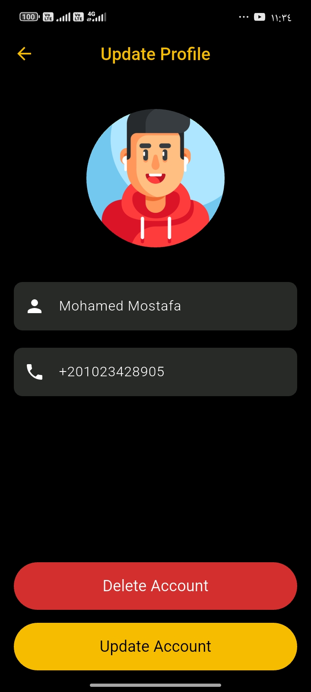
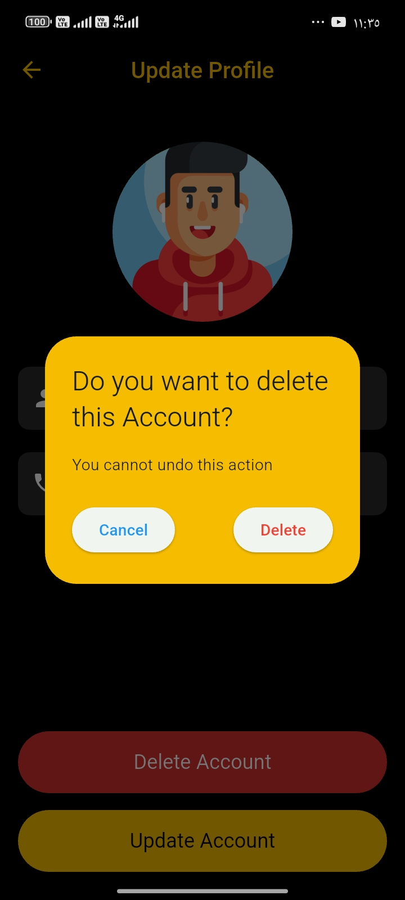

# 🎬 MovieHub – The Ultimate Movie Streaming App

  

A modern, elegant, and fully-featured movie streaming application built with **Flutter**.  
Supports browsing, detailed movie pages, favorites, history, profile management, secure authentication, and much more — all wrapped in a stunning dark UI.

---

## ✨ Features

- Full movie browsing with high-quality posters
- Detailed movie pages with trailers (YouTube Player)
- Add to Favorites & View History
- Watchlist (coming soon)
- Secure authentication (Email/Password + Google Sign-In)
- Complete Profile Management (Name, Phone, Avatar)
- Secure auto-login with encrypted token storage
- Onboarding screen (shown only once)
- Beautiful dark-themed UI with smooth animations
- Offline support & no-internet screen
- Clean, scalable architecture using **Bloc/Cubit**

---

## 📱 Screenshots

  
  
  

  
  
  
  

  
  
  
  

  
  
  
  

---

## 🚀 Getting Started

### Dependencies 📦

This project uses the following packages:

- [flutter_svg: ^2.0.10+1](https://pub.dev/packages/flutter_svg) – SVG rendering
- [cupertino_icons: ^1.0.8](https://pub.dev/packages/cupertino_icons) – iOS-style icons
- [animated_toggle_switch: ^0.8.2](https://pub.dev/packages/animated_toggle_switch) – Beautiful toggles
- [firebase_core: ^3.1.1](https://pub.dev/packages/firebase_core) – Firebase integration
- [firebase_auth: ^5.1.1](https://pub.dev/packages/firebase_auth) – Authentication
- [flutter_bloc: ^8.1.6](https://pub.dev/packages/flutter_bloc) – State management
- [equatable: ^2.0.5](https://pub.dev/packages/equatable) – Value comparison
- [provider: ^6.1.2](https://pub.dev/packages/provider) – Dependency injection
- [google_sign_in: ^6.2.1](https://pub.dev/packages/google_sign_in) – Google login
- [dio: ^5.9.0](https://pub.dev/packages/dio) – HTTP client with interceptors
- [youtube_player_flutter: ^9.1.3](https://pub.dev/packages/youtube_player_flutter) – Trailer playback
- [shared_preferences: ^2.5.3](https://pub.dev/packages/shared_preferences) – Local settings
- [flutter_secure_storage: ^9.2.4](https://pub.dev/packages/flutter_secure_storage) – Encrypted token storage

### Dev Dependencies

- [flutter_test](https://pub.dev/packages/flutter_test) – Unit & widget testing
- [flutter_lints](https://pub.dev/packages/flutter_lints) – Code quality & best practices

---

## 🔐 Local Data & Security

This app uses:

- **SharedPreferences** → For storing onboarding status, language, theme, etc.
- **flutter_secure_storage** → For securely storing authentication tokens  
  (Encrypted using Android Keystore & iOS Keychain)

Ensures smooth auto-login while keeping user data completely safe.

---

## 👨‍💻 Authors – Team 6

**Mohamed Mostafa** · **Moaz Yahya** · **Eslam Ahmed**  
**Karem Mohamed Esmail** · **Sherif Hassan Ebrahim**

**Route Academy** – Graduation Project  
This project was proudly developed as part of our graduation requirements at **Route Academy**.

We poured passion, dedication, and the latest Flutter best practices into **MovieHub** — a production-ready, clean, and scalable movie streaming experience.

Thank you for checking out our work! Don’t forget to ⭐ the repo!

---
**Made with ❤️ using Flutter**